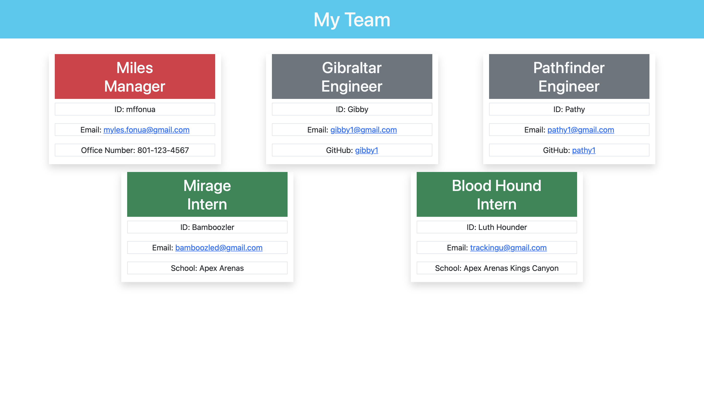

<h1 align="center">🗄 Team Profile Generator 🗄</h1>

 
## Description
This is a CLI application for those who need a way to be able to gather up their employees information in a one stop html for the team to use to exchange information

## Table of Contents
- [Description](#description)
- [Installation](#installation)
- [Usage](#usage)
- [Mockup](#mockup)
- [Questions](#questions)
- [License](#license)
- [Links](#links)
## Description
This app was created to allow for a user to create a team profile. 
## Installation
To Generate your own Team Profile, open your terminal and navigate to the folder of your project.

Run `npm install` in order to install the npm package dependencies as specified in the `package.json`. `inquirer` will prompt you for your inputs from the command line. 

This application will start by running `node index.js` from the command line. Follow the prompts to generate the Team Profile Generator file. 

After answering all the prompts, your Team Profile Generator will be available to view via index.html
## Usage

https://user-images.githubusercontent.com/108596346/194192831-ac32cd25-83ae-4832-9df5-6e3a28d1f23c.mp4

## License

 
This application is covered by the MIT license. 

## Mockup

## Questions
Please Contact me via email @ myles.fonua@gmail.com 

## License

 
This application is covered by the MIT license. 

## Links
* Link to GitHub Repository: https://github.com/mffonua/team-profile-generator
* Link to My Personal GitHub: https://github.com/mffonua  